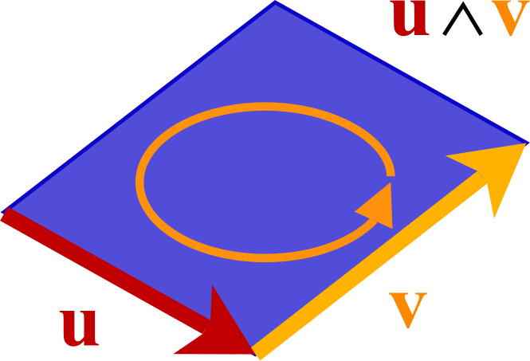
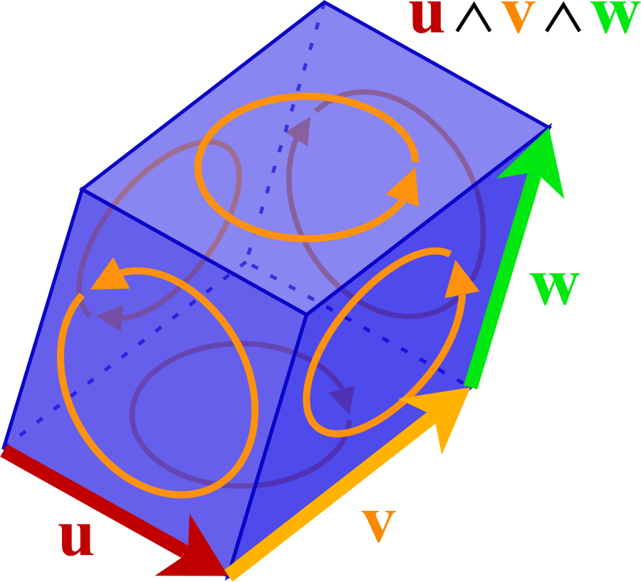

# G4MF Mesh Topology

## Overview

G4MF allows defining topology data for mesh surfaces via the `"geometry"` and `"seams"` properties on the mesh surface. This defines how the mesh surface is hierarchically structured in terms of its geometry and connectivity. The `"geometry"` property of bindings defines other data, like corner/vertex colors and texture maps, associated with the geometry structure.

G4MF is an N-dimensional format. Mesh surfaces store vertices in the mesh's `"vertices"` property, and edges in the surface's `"edges"` property. Edges always have exactly 2 vertices, so they are stored as pairs of vertex indices (no need to store "2 0 1" when "0 1" will do). Higher-dimensional polytopes have variable amounts of lower-dimensional elements on their boundaries, so their data is stored as a count followed by indices. The `"geometry"` array stores these higher-dimensional polytopes in successive tiers:

- **Geometry index 0** stores 2D polygons (faces) made of edge indices. For example, `4 0 1 2 3` defines a quad made of edges 0, 1, 2, and 3.
- **Geometry index 1** stores 3D polyhedra (volumes) made of polygon indices. For example, `6 0 1 2 3 4 5` defines a cube made of 6 square faces.
- **Geometry index 2** stores 4D polytopes (hypervolumes) made of polyhedron indices, and so on for higher dimensions.

Each tier references elements from the previous tier, building up the hierarchical structure of the mesh. For an N-dimensional mesh, N-dimensional elements (geometry index N-2) are the maximum possible, (N-1)-dimensional elements (geometry index N-3) define the boundary cells (possible to be visible), (N-2)-dimensional elements (geometry index N-4) define the border cells (possible to be seams), and so on. Edges are effectively geometry index negative 1, since geometry index 0 refers to them, but edges are structured separately, since each edge is always made of exactly 2 vertices.

This is useful for DCC applications, but usually not required for runtime applications like game engines. To save space, this data is usually omitted when "exporting" an optimized model only intended to be consumed by a runtime application, rather than "saving" a model to later be edited in a DCC application.

## Example

The following example defines.

## Mesh Surface Topology Properties

These properties are defined on the mesh surface object.

| Property     | Type        | Description                                                  | Default          |
| ------------ | ----------- | ------------------------------------------------------------ | ---------------- |
| **geometry** | `integer[]` | Hierarchical geometry data for this surface.                 | No geometry data |
| **seams**    | `integer`   | The list of which border geometry items are marked as seams. | No seams         |

### Geometry

The `"geometry"` property is an array of integers, each of which is an index that references an accessor containing complex hierarchical geometry data for this surface. This property is optional.

Hierarchical geometry data means that polytopes of successive dimensions are defined as combinations of polytopes from the previous dimension, providing structured topological data. This is similar to the data found within the [OFF file format](https://en.wikipedia.org/wiki/OFF_%28file_format%29), except that the first tier references edges, not points.

- The accessor at index 0 contains 2D faces. The first number is the amount of 1D edges on the boundary of the face, followed by the indices of the edges in the accessor referred to by the `"edges"` property. The next number after that is the amount of edges on the boundary of the second face, and so on.
- The accessor at index 1 contains 3D volumes. The first number is the amount of 2D faces on the boundary of the volume, followed by the indices of the faces just defined in the previous step. The next number after that is the amount of faces on the boundary of the second volume, and so on.
- The accessor at index 2 contains 4D hypervolumes. The first number is the amount of 3D volumes on the boundary of the hypervolume, followed by the indices of the volumes just defined in the previous step. The next number after that is the amount of volumes on the boundary of the second hypervolume, and so on.
- The accessor at index 3 contains 5D hypervolumes, which refer to 4D hypervolumes, and so on for 6D, 7D, and higher dimensional hypervolumes.

If defined, the array SHOULD have an amount of entries equivalent to the dimension of the model minus two, if defining only boundary geometry, or minus one, if filling the shape. For example, a 3D model may have geometry with index 0 for 2D faces, which define the boundary of the shape, in an array length of 1. Optionally, index 1 may be included, which would fill the shape solid using an array of length 2. For example, a 4D model may have geometry with index 0 for 2D faces and index 1 for 3D volumes, collectively defining the boundary of the shape, in an array length of 2. Optionally, index 2 may be included, which would fill the shape solid using an array of length 3.

This property allows preserving geometric information about polytopes and the connections between their parts. This is useful for DCC applications, and allows them to use G4MF as a save format. For example, Blender stores how faces connect to edges, therefore also storing how the faces connect to each other, preserving the topology of the mesh. Such information is useful for high-level operations like subdivision, smoothing, defining seams, and other operations that require knowledge of how the mesh topology is structured.

This property is not needed to render a cellular mesh if the `"simplexes"` property of the mesh surface is defined, since the `"simplexes"` property contains ready-to-use simplex cells. If the `"simplexes"` property is not present, the simplex cells can be computed from the geometry data, however this may be computationally expensive, especially for higher dimensions. When exporting a model to a final destination such as a game engine or other runtime, it is recommended to define the `"simplexes"` property, and the `"geometry"` property may be omitted to reduce file size.

Since the geometry accessor 0 refers to edges, the `"edges"` property MUST be defined and set to a valid value if the `"geometry"` property is defined and non-empty. If `"edges"` is not defined, and edges are calculated from the simplex cells, this calculated data CANNOT be used as the edges referenced by the `"geometry"` property, only explicitly defined edges can be used.

### Seams

The `"seams"` property is an integer that references an accessor containing the list of which border geometry items are marked as seams. If not defined, the surface does not have seams.

Seams refer to the boundaries of boundary geometry items; this is the dimension of the mesh minus 2. For 3D meshes, seams refer to 1D edges defined in the mesh surface `"edges"`, which bound 2D faces, since 2D faces form the boundary of 3D meshes. For 4D meshes, seams refer to 2D faces defined in the `"geometry"` property at index 0, which bound 3D cells at index 1, since 3D cells form the boundary of 4D meshes. For 5D meshes, seams refer to 3D cells defined in the `"geometry"` property at index 1, which bound 4D cells at index 2, since 4D cells form the boundary of 5D meshes, and so on for higher dimensions. 2D meshes are an exception, they use 2D faces like 3D meshes, and so their seams refer to 1D edges like 3D meshes.

This is a reference to an accessor in the G4MF file's document-level `"accessors"` array. The accessor MUST be of an unsigned integer component type, and MUST have the `"vectorSize"` property undefined or set to its default value of 1. Each primitive number component in the accessor is an index of an item in either the `"edges"` accessor or one of the accessors in `"geometry"`, and MUST NOT exceed the amount of border geometry items in the referenced accessor. For example, for 3D meshes, the maximum value in the seams accessor MUST NOT exceed the amount of edges in the `"edges"` accessor. For 4D meshes, the maximum value in the seams accessor MUST NOT exceed the amount of faces in the first geometry accessor, and so on. The seams accessor MUST NOT contain duplicate values, and MUST be sorted in strictly ascending order.

## Orientation of Geometry Items

Use cases like determining if a boundary geometry item is facing towards or away from a camera require having normal vectors which are perpendicular to the cell they describe. These normal vectors can be calculated, but then it is important to not only know how the geometry items are connected, but also their orientation. There are rules to uniquely determine the orientation of each geometry item based on its component parts. The rules mandated by G4MF follow the rules of Geometric Algebra extended from the right-hand rule.

Each 2D face has its orientation defined by its first 2 edges. The first 2 edges MUST share a vertex. Following edges MUST exist on the same plane spanned by the first 2 edges, MUST form a closed loop. For 2D faces only, the following edges MUST continue to share a vertex with the previous edge, until reaching the last edge, which MUST share a vertex with the first edge, closing the loop. The order of the first 2 edges defines the winding of the face. If the face's first 2 edges are swapped, the face's orientation is reversed. When a 2D face is used as the boundary of a 3D mesh, a counter-clockwise winding viewed by the camera means the face is facing towards the camera, while clockwise means it is facing away from the camera.

The face winding order is determined purely by the order of the edges, and does not consider the order of vertices within each edge. In this example image, if the arrows were pointing in the opposite direction, but the face still listed edge U before edge V, the face would still be considered to be facing towards the camera when interpreted as the boundary of a 3D mesh. To calculate the face normal, first find which vertex is shared between edge U and edge V. Find two vectors, one from the unshared vertex of edge U to the shared vertex, and one from the unshared vertex of edge U to the unshared vertex of edge V. Then, in 3D, the face normal is the cross product of these two vectors.

Each 3D cell has its orientation defined by its first 2 faces. The first 2 faces MUST share an edge. Following faces MUST exist on the same 3D hyperplane spanned by the first 2 faces, and MUST form a closed 3D volume. For dimensions 3 and higher, the order of following elements is not constrained, since it is not trivially defined how to traverse a closed volume in higher dimensions. The order of the first 2 faces defines the oriented volume of the cell. If the cell's first 2 faces are swapped, the cell's orientation is reversed. When a 3D cell is used as the boundary of a 4D mesh, an orientation like the below image in the XYZ axes means the cell is facing in the +W direction.

To calculate the cell normal, first find which edge is shared between the first 2 faces. In this example, the first face is the bottom face, formed by U and V, and the second face is the right face, formed by V and W. Get the edge on the first face after the shared edge, and get the edge on the second face after the shared edge. From those edges, get 4 vertices: the unshared vertex of the edge from the first face, the start vertex of the shared edge, the end vertex of the shared edge (such that the shared edge direction matters), and the unshared vertex of the edge from the second face (which adds to the span of the first face). Then, find the perpendicular product of the three vectors formed by the first vertex to each of the other three vertices. A cell facing in the +W direction, when these vectors are viewed in the XYZ axes, appears like the vectors of a right-handed basis with a positive determinant.

For dimensions 5 and higher, it is still the case that each N-dimensional cell has its orientation defined by its first two (N-1)-dimensional elements, which MUST share an (N-2)-dimensional element. Following elements MUST exist on the same N-dimensional hyperplane spanned by the first two elements, and MUST form a closed N-dimensional volume.

For more information, see the "Exterior Algebra" article on Wikipedia: https://en.wikipedia.org/wiki/Exterior_algebra

Both of the above images were created by Maschen, licensed as CC0 via Wikimedia Commons https://commons.wikimedia.org/wiki/File:N_vector_positive.svg

## JSON Schema

- See [g4mf.mesh.surface.schema.json](../../schema/mesh/g4mf.mesh.surface.schema.json) for the mesh surface properties JSON schema.
- See [g4mf.mesh.surface.binding.schema.json](../../schema/mesh/g4mf.mesh.surface.binding.schema.json) for the binding properties JSON schema.
- See [g4mf.mesh.surface.binding.geometry.schema.json](../../schema/mesh/g4mf.mesh.surface.binding.geometry.schema.json) for the geometry decomposition properties JSON schema.
- See [g4mf.mesh.schema.json](../../schema/mesh/g4mf.mesh.schema.json) for the mesh properties JSON schema.
